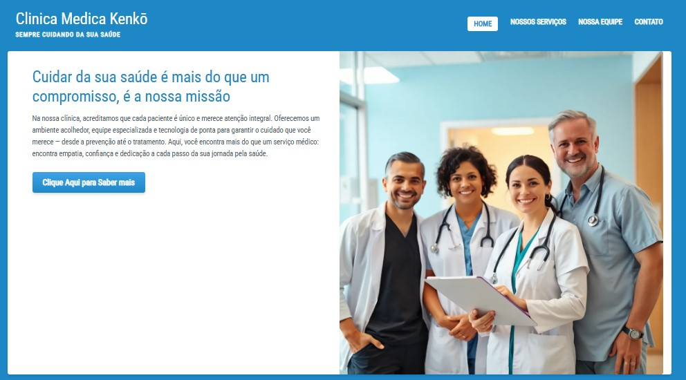
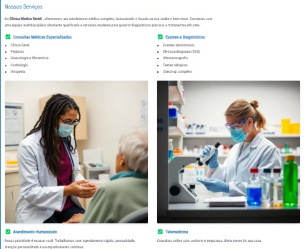
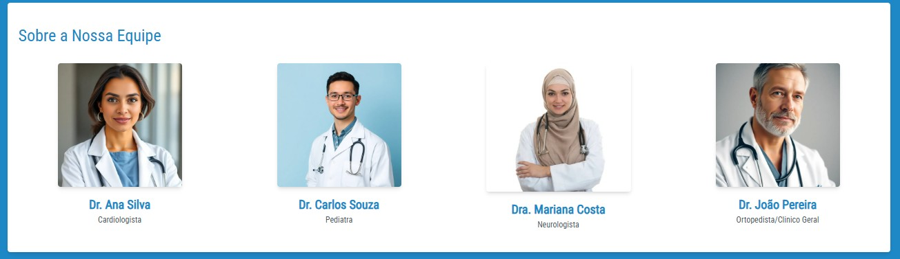

# Clínica Médica Kenkō

> Um Landpage feito para a Sistematização no Uniceub. O site tem  atendencia institucional responsivo para a Clínica Médica Kenkō, desenvolvido com **HTML**, **Tailwind CSS** e **Font Awesome**, com o objetivo de apresentar os serviços, equipe e informações de contato da clínica de forma clara, elegante e acessível.

## 🩺 Visão Geral

A Clínica Médica Kenkō é dedicada ao cuidado integral com a saúde, oferecendo atendimento humanizado, equipe multidisciplinar e uma estrutura moderna. Este site foi criado para apresentar os principais serviços da clínica, informações sobre os profissionais da equipe e facilitar o contato com pacientes.

---

## ✨ Funcionalidades

- ✅ Página inicial com introdução à clínica
- ✅ Seção “Nossos Serviços” com:
  - Consultas Médicas Especializadas
  - Exames e Diagnósticos
  - Atendimento Humanizado
  - Telemedicina
  - Planos e Convênios
- ✅ Seção “Nossa Equipe” com fotos e especialidades dos médicos
- ✅ Navegação fluida entre seções via links
- ✅ Estilo moderno com Tailwind CSS
- ✅ Design responsivo para dispositivos móveis

---

## 🛠️ Tecnologias Utilizadas

- **HTML5** – Estrutura semântica
- **Tailwind CSS** – Estilização moderna e responsiva
- **Font Awesome** – Ícones visuais para aprimorar a interface
- **Google Fonts** – Tipografia personalizada com Roboto Condensed

---

## 📁 Estrutura de Pastas

```bash
clinica-kenko/
├── index.html
├── recursos/
│   ├── css/
│   │   └── styles.css
│   └── images/
│       ├── imagem_exemplo_equipe.jpg
│       ├── imagem_exemplo_atendimento.jpg
│       ├── imagem_exemplo_pesquisa.jpg
│       ├── imagem_exemplo_atendimento_huma.jpg
│       ├── imagem_exemplo_atendimento_online.jpg
│       ├── preco-planos-de-saude-brasil.jpg
│       ├── imagem_exemplo_Dra2.jpg
│       ├── imagem_exemplo_Dr_Pediatra.jpg
│       └── Imagem_Exemplo_Dra.jpg
```

---

## 📷 Capturas de Tela

### Página Inicial


### Serviços Médicos


### Equipe Médica


---

## 🚀 Como Executar Localmente

1. Clone este repositório:
   ```bash
   git clone https://github.com/seu-usuario/clinica-kenko.git
   ```

2. Navegue até a pasta do projeto:
   ```bash
   cd clinica-kenko
   ```

3. Abra o arquivo `index.html` em qualquer navegador:
   - Clique duas vezes no arquivo ou
   - Use uma extensão como **Live Server** no VS Code

---

## 💡 Melhorias Futuras

- Formulário de contato funcional
- Integração com API de agendamento
- Adição de um mapa com localização via Google Maps
- Otimizações de SEO e performance

---

## 👩‍⚕️ Dev do Projeto

- Desenvolvedor: Gabriel de Morais Rodrigues
- Projeto fictício para fins educacionais para apresentação da materia Programação e Desenvolvimento Web do Uniceub 

---

## 📄 Licença

Este projeto é de uso livre para fins acadêmicos ou demonstração pessoal. Não é afiliado a nenhuma clínica real.

---

## 🌐 Contato

Você pode entrar em contato comigo através do [LinkedIn](https://www.linkedin.com/in/gabriel-morais-3078338a/) ou [E-mail](gmr_3@hotmail.com).

---
